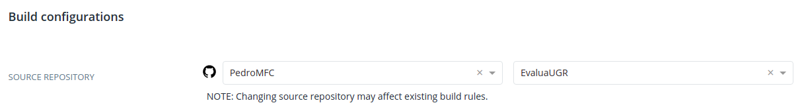
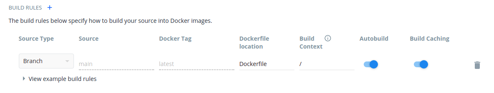
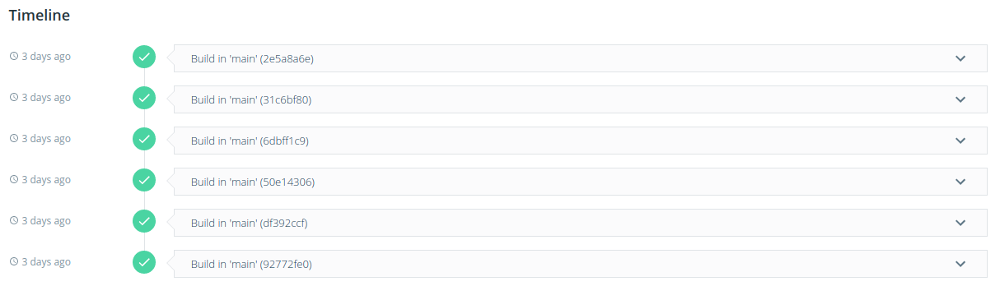
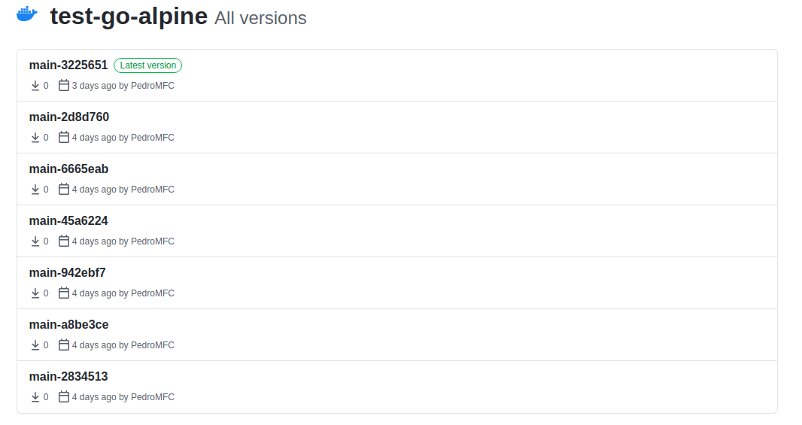

# EvaluaUGR
Proyecto para la asignatura de Cloud Computing del Máster en Ingeniería Informática.

## Contenedor base, optimización y Dockerfile

Debido a que los procesos de elección del contenedor base y optimización han ido de la mano, se ha decidido juntar ambas rúbricas. 

Entre los enlaces que se han consultado para realizar este proceso son los siguientes, aunque no se refieran al propio lenguaje, pero las herramientas o los procesos que comentan son útiles:

 * [How We Reduce Node Docker Image Size In 3 Steps](https://medium.com/trendyol-tech/how-we-reduce-node-docker-image-size-in-3-steps-ff2762b51d5a).
 * [Tips to Reduce Docker Image Sizes](https://hackernoon.com/tips-to-reduce-docker-image-sizes-876095da3b34).
 * [Slim Docker images for your Go application](https://dev.to/andrioid/slim-docker-images-for-your-go-application-11oo).
 * [Best practices for writing Dockerfiles](https://docs.docker.com/develop/develop-images/dockerfile_best-practices/).
 * [Intro Guide to Dockerfile Best Practices](https://www.docker.com/blog/intro-guide-to-dockerfile-best-practices/).

Todo el proceso detallado se encuentra en en el archivo [docker][docker] dentro de la documentación, donde también puede encontrar imágenes y enlace a los *commits*. Si se quiere obtener toda la información se **recomienda consultarlo**. A modo de resumen,en nuestro caso necesitamos que la imagen contenga en lenguaje `Go` y el gestor de tareas `Task`. De este modo, partimos en principio de dos imágenes que tienen instalado el lenguaje: oficial de `Go` Alpine y [webhippie/golang](https://hub.docker.com/r/webhippie/golang) (no oficial). Como en las buenas prácticas también recomienda usar desde el primer momento imágenes lo más reducidas posibles, se ha probado con Alpine como tercera opción (hay que instalar tanto lenguaje como gestor). En los primeros Dockerfile de prueba, comprobamos que la imagen no oficial era demasiado pesada (porque contenía preinstaladas más cosas y sería más complicado de optimizar) por lo que nos centramos en la otras dos, destacando que en Alpine aumentaba mucho el tamaño. Sin embargo, usando la construcción en múltiples etapas y la herramienta [dive](https://github.com/wagoodman/dive), conseguimos reducir el tamaño de la imagen oficial de 314 MB a 305 MB y en Alpine la bajamos de 463 MB iniciales a 303 MB. Por ello, la imagen base escogida es la de Alpine.

El archivo Dockerfile lo puede consultar [aquí](./Dockerfile). Se ha intentado seguir las buenas prácticas para su escritura como por ejemplo poner las palabras clave en mayúscula, agrupar sentencias RUN, usar LABEL (según las buenas prácticas, antes de Docker 1.10 se recomendaba una única instrucción LABEL para evitar capas extra pero indica que ya no es necesario) en vez de MAINTAINER, copiar solo lo necesario, etc. También se ha creado un usuario que no sea *root* para ejecutar los tests. Se ha configurado el contenedor para que ejecute directamente los tests. Para ello, hay que indicar que en `/app/test` se monte este directorio del proyecto y a continuación el contenedor pasa a ejecutar directamente `task test`.

## Contenedor subido a Docker Hub

El enlace a la página de Docker Hub donde está el contenedor es [este](https://hub.docker.com/r/pedromfc/evaluaugr). En las siguientes imágenes vemos cómo se ha configurado para las construcciones automáticas así como el historial de las mismas.

Se ha consultado [este tutorial](https://www.youtube.com/watch?v=SzzwFauxK98) para saber cómo hacer el proceso de automatización.

## Uso de registros alternativos y públicos de contenedores

Como registro alternativo se ha decidido usar GitHub Docker Registry. Alguna información sobre su configuración la podemos encontrar [aquí](https://docs.github.com/es/free-pro-team@latest/packages/using-github-packages-with-your-projects-ecosystem/configuring-docker-for-use-with-github-packages). El proceso grosso modo es crear un nuevo *TOKEN* y añadirlo a docker. En ese momento, podemos hacer push indicando que queremos enviarlo a GitHub. Para no tener que hacer este proceso manual, se ha configurado una GitHub Action, maś concretamente a partir de [Docker Build & Push Action](https://github.com/marketplace/actions/docker-build-push-action) disponible en el *Marketplace* que permite hacerlo de una manera sencilla y además te explica los pasos. Así se ha creado el archivo [auto-gcr.yml](.github/workflows/auto-gcr.yml). En la siguiente imagen vemos cómo se han ido subiendo a [este enlace](https://github.com/PedroMFC/EvaluaUGR/packages/508196) de forma automática

## Avance del proyecto

Desde la última revisión se ha avanzado código y hecho test nuevos en estos archivos.

- [Valoracion](./internal/microval/modelsval/valoracion.go)
- [ValoracionRepositorio](./internal/microval/modelsval/valoracionrepositorio.go)
- [valoracion_test](./tests/valoracion_test.go)

según las historias de usuario [HU10](https://github.com/PedroMFC/EvaluaUGR/issues/62) y [HU11](https://github.com/PedroMFC/EvaluaUGR/issues/63).

También por indicaciones anteriores, se ha consultado dónde colocar los archivos de test en un proyecto de `Go`. Los enlaces consultados presentan disparidad de opiniones ya que hay partidarios de colocarlos en el [mismo paquete](https://stackoverflow.com/questions/19200235/golang-tests-in-sub-directory) o en [diferente](https://medium.com/@matryer/5-simple-tips-and-tricks-for-writing-unit-tests-in-golang-619653f90742). Entre los enlaces más interesantes se encuentra [Proper package naming for testing with the Go language](https://stackoverflow.com/questions/19998250/proper-package-naming-for-testing-with-the-go-language/31443271#31443271) que es una respuesta en la página *Stackoverflow*. Indica que depende de cómo se enfoquen los tests (caja blanca o caja negra) y que no hay nada malo en usar un método u otro. En mi caso, se ha optado por mantener los tests en paquetes diferentes al código como hasta ahora, en un mismo paquete.

## Documentación
Puede consultar más información acerca del proyecto en los siguientes enlace:

* [Problema a resolver][problema].
* [Puesta a punto del repositorio][configGitHub].
* [La documentación sobre la selección de herramientas][herramientas].
* [Información sobre la arquitectura empleada][arquitectura].
* [Planificación][planificacion].
* [Test][tests].

[configGitHub]: https://pedromfc.github.io/EvaluaUGR/docs/configuracion_github
[herramientas]: https://pedromfc.github.io/EvaluaUGR/docs/seleccion_herramientas
[problema]: https://pedromfc.github.io/EvaluaUGR/docs/problema
[arquitectura]: https://pedromfc.github.io/EvaluaUGR/docs/arquitectura
[issues]: https://github.com/PedroMFC/EvaluaUGR/issues
[planificacion]: https://pedromfc.github.io/EvaluaUGR/docs/planificación
[docker]: https://pedromfc.github.io/EvaluaUGR/docs/docker
[tests]: https://pedromfc.github.io/EvaluaUGR/docs/tests

[mAuxiliar]: https://github.com/PedroMFC/EvaluaUGR/milestone/2
[mPreguntas]: https://github.com/PedroMFC/EvaluaUGR/milestone/5
[mErrores]: https://github.com/PedroMFC/EvaluaUGR/milestone/3
[mEstructura]: https://github.com/PedroMFC/EvaluaUGR/milestone/7
[mResenias]: https://github.com/PedroMFC/EvaluaUGR/milestone/6
[mDocumentacion]: https://github.com/PedroMFC/EvaluaUGR/milestone/1
[mValoraciones]: https://github.com/PedroMFC/EvaluaUGR/milestone/4
[mTests]: https://github.com/PedroMFC/EvaluaUGR/milestone/8

[i1]: https://github.com/PedroMFC/EvaluaUGR/issues/1
[i2]: https://github.com/PedroMFC/EvaluaUGR/issues/2
[i3]: https://github.com/PedroMFC/EvaluaUGR/issues/3
[i4]: https://github.com/PedroMFC/EvaluaUGR/issues/4
[i5]: https://github.com/PedroMFC/EvaluaUGR/issues/5
[i6]: https://github.com/PedroMFC/EvaluaUGR/issues/6
[i7]: https://github.com/PedroMFC/EvaluaUGR/issues/7
[i8]: https://github.com/PedroMFC/EvaluaUGR/issues/8
[i9]: https://github.com/PedroMFC/EvaluaUGR/issues/9
[i10]: https://github.com/PedroMFC/EvaluaUGR/issues/10
[i11]: https://github.com/PedroMFC/EvaluaUGR/issues/11
[i12]: https://github.com/PedroMFC/EvaluaUGR/issues/12
[i13]: https://github.com/PedroMFC/EvaluaUGR/issues/13
[i14]: https://github.com/PedroMFC/EvaluaUGR/issues/14
[i15]: https://github.com/PedroMFC/EvaluaUGR/issues/15
[i16]: https://github.com/PedroMFC/EvaluaUGR/issues/16
[i17]: https://github.com/PedroMFC/EvaluaUGR/issues/17
[i18]: https://github.com/PedroMFC/EvaluaUGR/issues/18
[i19]: https://github.com/PedroMFC/EvaluaUGR/issues/19
[i20]: https://github.com/PedroMFC/EvaluaUGR/issues/20
[i21]: https://github.com/PedroMFC/EvaluaUGR/issues/21
[i22]: https://github.com/PedroMFC/EvaluaUGR/issues/22
[i23]: https://github.com/PedroMFC/EvaluaUGR/issues/23
[i24]: https://github.com/PedroMFC/EvaluaUGR/issues/24
[i25]: https://github.com/PedroMFC/EvaluaUGR/issues/25
[i26]: https://github.com/PedroMFC/EvaluaUGR/issues/26
[i27]: https://github.com/PedroMFC/EvaluaUGR/issues/27
[i28]: https://github.com/PedroMFC/EvaluaUGR/issues/28
[i29]: https://github.com/PedroMFC/EvaluaUGR/issues/29
[i30]: https://github.com/PedroMFC/EvaluaUGR/issues/30
[i31]: https://github.com/PedroMFC/EvaluaUGR/issues/31
[i32]: https://github.com/PedroMFC/EvaluaUGR/issues/32
[i33]: https://github.com/PedroMFC/EvaluaUGR/issues/33
[i34]: https://github.com/PedroMFC/EvaluaUGR/issues/34
[i35]: https://github.com/PedroMFC/EvaluaUGR/issues/35
[i36]: https://github.com/PedroMFC/EvaluaUGR/issues/36
[i37]: https://github.com/PedroMFC/EvaluaUGR/issues/37
[i38]: https://github.com/PedroMFC/EvaluaUGR/issues/38
[i39]: https://github.com/PedroMFC/EvaluaUGR/issues/39
[i40]: https://github.com/PedroMFC/EvaluaUGR/issues/40
[i41]: https://github.com/PedroMFC/EvaluaUGR/issues/41
[i42]: https://github.com/PedroMFC/EvaluaUGR/issues/42
[i43]: https://github.com/PedroMFC/EvaluaUGR/issues/43
[i44]: https://github.com/PedroMFC/EvaluaUGR/issues/44
[i45]: https://github.com/PedroMFC/EvaluaUGR/issues/45
[i46]: https://github.com/PedroMFC/EvaluaUGR/issues/46
[i47]: https://github.com/PedroMFC/EvaluaUGR/issues/47
[i48]: https://github.com/PedroMFC/EvaluaUGR/issues/48
[i49]: https://github.com/PedroMFC/EvaluaUGR/issues/49
[i50]: https://github.com/PedroMFC/EvaluaUGR/issues/50
[i51]: https://github.com/PedroMFC/EvaluaUGR/issues/51
[i52]: https://github.com/PedroMFC/EvaluaUGR/issues/52
[i53]: https://github.com/PedroMFC/EvaluaUGR/issues/53
[i54]: https://github.com/PedroMFC/EvaluaUGR/issues/54
[i55]: https://github.com/PedroMFC/EvaluaUGR/issues/55
[i56]: https://github.com/PedroMFC/EvaluaUGR/issues/56
[i57]: https://github.com/PedroMFC/EvaluaUGR/issues/57
[i58]: https://github.com/PedroMFC/EvaluaUGR/issues/58
[i59]: https://github.com/PedroMFC/EvaluaUGR/issues/59
[i60]: https://github.com/PedroMFC/EvaluaUGR/issues/60
