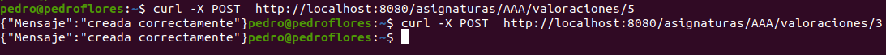

# EvaluaUGR
Proyecto para la asignatura de Cloud Computing del Máster en Ingeniería Informática.

## Clúster

El clúster se pude observar en el archivo [docker-compose.yml](docker-compose.yml). En él vemos que utilizamos cuatro contenedores.

* postgres: este contenedor es el encargado del almacenamiento de datos.
* etcd: es el servicio `etcd` que guarda las claves para la configuración distribuida.
* logstash: es el contenedor donde se envían los logs.
* app: es el servicio que nosotros hemos construido.

Vemos, que la estructura del clúster corresponde básicamente a la de la aplicación que queremos construir. Tenemos un servicio que que ofrece cierta funcionalidad mediante un API REST. Este servicio necesita por un lado un almacenamiento de datos y por otro configuración distribuida para almacenar su propia información y poder ver la de los demás si fuera necesario. También se ha decidido incluir el contenedor de logs ya que es muy importante ir almacenando dicha información y disponer de ella posteriormente para detectar posibles problemas y/o conocer su comportamiento.

## Configuración de los contenedores

Ahora, explicaremos un poco más en profundidad cada uno de los contenedores que componen nuestro clúster.

* postgres: utilizamos la [imagen oficial](https://hub.docker.com/_/postgres) y además en su versión `9.6-alpine` ya que tiene menor tamaño que la versión `latest` (37.2MB y 159MB respectivamente) por lo que obtenemos una gran ventaja. En cuanto al uso de `postgresql` como base de datos, se ha decido que sea así ya que al ser una base de datos relacional, su sintaxis es parecida a MySQL con la que se está más familiarizado. Sin embargo, *a priori* el problema no presenta ninguna restricción para poder usar bases de datos no relacionales como MongoDB. En cuanto a su configuración, nos hemos ayudado de [esta guía](https://levelup.gitconnected.com/dockerized-crud-restful-api-with-go-gorm-jwt-postgresql-mysql-and-testing-61d731430bd8) para saber su uso con docker-compose. A rasgos generales, le tenemos que indicar mediante variables de entorno el usuario, contraseña, etc. y mapeamos los puertos manteniendo el 5432 que el que su usa normalmente en postgresql.
* etcd: el contendor que usamos es el de [bitnami](https://hub.docker.com/r/bitnami/etcd/) que ya vimos en clase y que además es de los más populares y se actualiza con frecuencia. Para configurarlo, hemos usado la especificación que viene explicada en su [repositorio de GitHib](https://github.com/bitnami/bitnami-docker-etcd#using-docker-compose). 
* logstash: es una de las herramientas de la pila ELK que también comentamos en clase. Esta en específico es un recolector de logs. Para usarla en docker-compose se han usado los tutoriales [ELK stack deployment through docker-compose](https://medium.com/@harisshafiq08/elk-stack-deployment-through-docker-compose-98ce40ff2fb6) y [How to integrate your Go Service with ELK](https://pmihaylov.com/go-service-with-elk/) que explican cómo usar todas la herramientas ELK. Destacamos tanto el mapeo de puertos como el archivo de configuración [logstash.con](./config/logstash.conf). En este archivo indicamos el puerto y el codec de entrada `json`. Para la salida, en principio la mostramos por pantalla aunque se podría enviar sin ningún problema a `elasticsearch` modificando el archivo.
* app: este es el servicio que nosotros hemos construido. Ya se ha explicado anteriormente cómo está construido. Notamos las modificaciones que se han hecho en el [Dockerfile](Dockerfile). Primero, exponemos el puerto 8080 para poder recibir peticiones en el mismo. En segundo lugar, se ha incluido incluido la herramienta `docker-compose-wait`. Este se debe a que la orden `depends_on` solo espera  a que el contenedor esté arrancado no a que esté listo para recibir peticiones, como se indica en la [documentación](https://docs.docker.com/compose/startup-order/). En el enlace anterior se muestran gran cantidad de mecanismos para solucionarlo pero la herramienta que se ha usado y se explica [aquí](https://www.datanovia.com/en/lessons/docker-compose-wait-for-container-using-wait-tool/#:~:text=The%20docker-compose-wait%20tool%20is%20a%20small%20command%20line,open%20on%20a%20target%20image.) nos ha dado buenos resultados. Aparte de incluir en el `Dockerfile`, en el `docker-compose` indicamos a los hosts a los que queremos esperar (entre otros) y luego mediante `command: ["sh","-c","/wait"]` esperamos a que estén listos. De todos modos, si hubiera un problema, se volvería arrancar el servicio mediante `restart`.

## Ficheros de composición

Tanto los contenedores usados como la configuración de los mimos ya se han explicado *grosso modo* en las secciones anteriores. Notamos sin embargo, que se ha intentado usar la configuración como código haciendo que los nombres, puertos, etc. no están ya explícitos si no que se puedan modificar mediante variables de entorno. También usamos otros mecanismos como [$PWD](https://gist.github.com/shaiguitar/627d52ebc0c03af488477b5d636a8909) para montar el directorio actual correctamente a nuestro servicio independientemente de dónde se lance. En cuanto a la versión del `docker-compose`, se ha utilizado la 3 por usar la última versión aunque en principio no impide que se use con la versión 2. Finalmente, la red que se ha creado utiliza el driver `bridge`, que es que viene [por defecto](https://docs.docker.com/network/) y que cumple con nuestras necesidades.

## Testeo

El archivo [docker-compose.yml](docker-compose.yml) está más pensado para el despliegue de la aplicación ya que como se puede observar en el mismo, al final lo que hacemos es arrancar el servicio. Sin embargo, para el testeo no necesitamos, ni `etcd` ni `logstash`. Por ello, para hacer más rápido el proceso de test se ha creado un archivo "simplificado" [docker-compose.travis.yml](docker-compose.travis.yml) que parte del anterior pero manteniendo solamente nuestra aplicación y el almacenamiento de datos que son los necesarios para lanzar los tests. Como explicaremos en el apartado avances, para los nuevos tests de conexión de la base de datos, es necesario asegurarse tener el servicio `postgresql`. Por ello, la tarea `test` del archivo de tareas [Taskfile.yml](Taskfile.yml) se limita a lanzar los tests que no requieren base datos y la nueva orden `test-complete` lanza todos. Así, en Travis al tener disponible el almacenamiento de datos lanzamos el conjunto de tests completo como vemos en [.travis.yml](.travis.yml) y [docker-compose.travis.yml](docker-compose.travis.yml). Para la configuración de travis se ha usado la información disponible en el material de la asignatura.

En cuanto a los test, ya teníamos tests de unidad para las clases que usaban la tabla hash (y ahora incluimos para la base de datos) y tests de integración mockeados. Posteriormente, veremos tests de velocidad. Por ello, ahora vamos a ver mediante tests funcionales si la aplicación se comporta como esperamos. Para ello, lanzamos el docker-compose con la aplicación mediante la orden `task docker-compose-up` (si quisiéramos lanar los tests usaríamos `task docker-compose-test`). En principio, se pensó usar algún ORM com [Gorm](https://gorm.io/docs/index.html) para hacer este proceso más fácil. Sin embargo, no funcionaba correctamente el almacenamiento en la base de datos por lo que se ha usado directamente mediante órdenes, aunque sea algo más complejo. De todos modos, lso ORM tienen ciertas desventajas, como por ejemplo [ralentizar la aplicación](https://www.calhoun.io/subtle-issues-with-orms-and-how-to-avoid-them/). Veamos ahora ejemplos reales del uso de la aplicación:

Y también un ejemplo de cómo ser vería un log con `logstash`:

## Tests de velocidad y avances
Para los tests de velocidad, ya se hicieron unas pequeñas pruebas para comparar los *frameworks*. Ahora, se van a hacer algunos tests para comprobar la velocidad del servicio arrancado de manera local. Seguimos usando el paquete de *benchmarking* que viene con el lenguaje. Sin embargo, se va a usar de manera complementaria con [hrtesting](https://medium.com/@egonelbre/benchmarking-with-details-1cf3e61d459d) que nos da una mayor cantidad de información. Para ello, se han llevado a cabo operaciones de `PUT`, `GET` y `POST` como se observa en el archivo [benchmark_test.go](tests/benchmark_test.go). Los resultados han sido.

| ORDEN | OPERACIONES | ns/op | ns/p50 | ns/p90 | B/op |
| -- | -- | -- | -- | -- | -- |
| PUT | 50| 24204518 | 22221130 | 33406516 | 15126 |
| POST | 39 | 37553121 | 33441512 | 55592635 | 17012 |
| GET | 634 | 1697939 | 1525714 | 1932750 | 15594 |

Vemos que la operación más rápida es `GET` seguida de `PUT` y luego `POST`. De cada una de ellas, el tiempo medio por operación ha sido  1.69 ms, 37.55ms y 24.20 ms.
 
En cuanto a los avances del proyecto, como se ha comentado ahora tenemos conexión a base de datos. Por ello, ha sido neceario crear las clases [Valoraciondb](internal/microval/modelsval/valoraciondb.go), [ReseniasDB](internal/microres/modelsres/reseniasdb.go) y [PreguntasDB](internal/micropre/modelspre/preguntasdb.go). Estas clases tienen sus correspondientes archivos de test: [valdbsaver_test.go](tests/valdbsaver_test.go), [resdbsaver_test.go](tests/resdbsaver_test.go) y [predbsaver_test.go](tests/predbsaver_test.go). Para su implementación se han usado los tutoriales [Using PostgreSQL with Go](https://www.calhoun.io/using-postgresql-with-go/). También se ha creado una nueva clase [Config](internal/config.go) que contiene información acerca de la configuración de la aplicación para tener la misma en un único lugar. También se han considerado las propuestas acerca de los URIs hechas en correcciones anteriores. Tras pensarlo detenidamente, se [ha decidido cambiarlo][i95] y se puede ver claramente en el archivo modifidicado de [rutas](docs/rutas.md).

## Documentación
Puede consultar más información acerca del proyecto en los siguientes enlace:

* [Problema a resolver][problema].
* [Puesta a punto del repositorio][configGitHub].
* [La documentación sobre la selección de herramientas][herramientas].
* [Información sobre la arquitectura empleada][arquitectura].
* [Planificación][planificacion].
* [Test][tests].
* [Docker][dockerR].
* [Integración continua][CI].
* [Microservicio][micro].

[configGitHub]: https://pedromfc.github.io/EvaluaUGR/docs/configuracion_github
[herramientas]: https://pedromfc.github.io/EvaluaUGR/docs/seleccion_herramientas
[problema]: https://pedromfc.github.io/EvaluaUGR/docs/problema
[arquitectura]: https://pedromfc.github.io/EvaluaUGR/docs/arquitectura
[issues]: https://github.com/PedroMFC/EvaluaUGR/issues
[planificacion]: https://pedromfc.github.io/EvaluaUGR/docs/planificación
[docker]: https://pedromfc.github.io/EvaluaUGR/docs/docker
[tests]: https://pedromfc.github.io/EvaluaUGR/docs/tests
[dockerR]: https://pedromfc.github.io/EvaluaUGR/docs/docker_README
[CI]: https://pedromfc.github.io/EvaluaUGR/docs/CI
[rutas]: https://pedromfc.github.io/EvaluaUGR/docs/rutas
[micro]: https://pedromfc.github.io/EvaluaUGR/docs/microservicio

[mAuxiliar]: https://github.com/PedroMFC/EvaluaUGR/milestone/2
[mPreguntas]: https://github.com/PedroMFC/EvaluaUGR/milestone/5
[mErrores]: https://github.com/PedroMFC/EvaluaUGR/milestone/3
[mEstructura]: https://github.com/PedroMFC/EvaluaUGR/milestone/7
[mResenias]: https://github.com/PedroMFC/EvaluaUGR/milestone/6
[mDocumentacion]: https://github.com/PedroMFC/EvaluaUGR/milestone/1
[mValoraciones]: https://github.com/PedroMFC/EvaluaUGR/milestone/4
[mTests]: https://github.com/PedroMFC/EvaluaUGR/milestone/8

[hu1]: https://github.com/PedroMFC/EvaluaUGR/issues/12
[hu2]: https://github.com/PedroMFC/EvaluaUGR/issues/13
[hu3]: https://github.com/PedroMFC/EvaluaUGR/issues/14
[hu4]: https://github.com/PedroMFC/EvaluaUGR/issues/15
[hu5]: https://github.com/PedroMFC/EvaluaUGR/issues/16
[hu6]: https://github.com/PedroMFC/EvaluaUGR/issues/17
[hu7]: https://github.com/PedroMFC/EvaluaUGR/issues/18
[hu8]: https://github.com/PedroMFC/EvaluaUGR/issues/19
[hu9]: https://github.com/PedroMFC/EvaluaUGR/issues/20
[hu10]: https://github.com/PedroMFC/EvaluaUGR/issues/62
[hu11]: https://github.com/PedroMFC/EvaluaUGR/issues/63
[hu12]: https://github.com/PedroMFC/EvaluaUGR/issues/75
[hu13]: https://github.com/PedroMFC/EvaluaUGR/issues/79
[hu14]: https://github.com/PedroMFC/EvaluaUGR/issues/80
[hu15]: https://github.com/PedroMFC/EvaluaUGR/issues/81
[hu16]: https://github.com/PedroMFC/EvaluaUGR/issues/82

[i1]: https://github.com/PedroMFC/EvaluaUGR/issues/1
[i2]: https://github.com/PedroMFC/EvaluaUGR/issues/2
[i3]: https://github.com/PedroMFC/EvaluaUGR/issues/3
[i4]: https://github.com/PedroMFC/EvaluaUGR/issues/4
[i5]: https://github.com/PedroMFC/EvaluaUGR/issues/5
[i6]: https://github.com/PedroMFC/EvaluaUGR/issues/6
[i7]: https://github.com/PedroMFC/EvaluaUGR/issues/7
[i8]: https://github.com/PedroMFC/EvaluaUGR/issues/8
[i9]: https://github.com/PedroMFC/EvaluaUGR/issues/9
[i10]: https://github.com/PedroMFC/EvaluaUGR/issues/10
[i11]: https://github.com/PedroMFC/EvaluaUGR/issues/11
[i12]: https://github.com/PedroMFC/EvaluaUGR/issues/12
[i13]: https://github.com/PedroMFC/EvaluaUGR/issues/13
[i14]: https://github.com/PedroMFC/EvaluaUGR/issues/14
[i15]: https://github.com/PedroMFC/EvaluaUGR/issues/15
[i16]: https://github.com/PedroMFC/EvaluaUGR/issues/16
[i17]: https://github.com/PedroMFC/EvaluaUGR/issues/17
[i18]: https://github.com/PedroMFC/EvaluaUGR/issues/18
[i19]: https://github.com/PedroMFC/EvaluaUGR/issues/19
[i20]: https://github.com/PedroMFC/EvaluaUGR/issues/20
[i21]: https://github.com/PedroMFC/EvaluaUGR/issues/21
[i22]: https://github.com/PedroMFC/EvaluaUGR/issues/22
[i23]: https://github.com/PedroMFC/EvaluaUGR/issues/23
[i24]: https://github.com/PedroMFC/EvaluaUGR/issues/24
[i25]: https://github.com/PedroMFC/EvaluaUGR/issues/25
[i26]: https://github.com/PedroMFC/EvaluaUGR/issues/26
[i27]: https://github.com/PedroMFC/EvaluaUGR/issues/27
[i28]: https://github.com/PedroMFC/EvaluaUGR/issues/28
[i29]: https://github.com/PedroMFC/EvaluaUGR/issues/29
[i30]: https://github.com/PedroMFC/EvaluaUGR/issues/30
[i31]: https://github.com/PedroMFC/EvaluaUGR/issues/31
[i32]: https://github.com/PedroMFC/EvaluaUGR/issues/32
[i33]: https://github.com/PedroMFC/EvaluaUGR/issues/33
[i34]: https://github.com/PedroMFC/EvaluaUGR/issues/34
[i35]: https://github.com/PedroMFC/EvaluaUGR/issues/35
[i36]: https://github.com/PedroMFC/EvaluaUGR/issues/36
[i37]: https://github.com/PedroMFC/EvaluaUGR/issues/37
[i38]: https://github.com/PedroMFC/EvaluaUGR/issues/38
[i39]: https://github.com/PedroMFC/EvaluaUGR/issues/39
[i40]: https://github.com/PedroMFC/EvaluaUGR/issues/40
[i41]: https://github.com/PedroMFC/EvaluaUGR/issues/41
[i42]: https://github.com/PedroMFC/EvaluaUGR/issues/42
[i43]: https://github.com/PedroMFC/EvaluaUGR/issues/43
[i44]: https://github.com/PedroMFC/EvaluaUGR/issues/44
[i45]: https://github.com/PedroMFC/EvaluaUGR/issues/45
[i46]: https://github.com/PedroMFC/EvaluaUGR/issues/46
[i47]: https://github.com/PedroMFC/EvaluaUGR/issues/47
[i48]: https://github.com/PedroMFC/EvaluaUGR/issues/48
[i49]: https://github.com/PedroMFC/EvaluaUGR/issues/49
[i50]: https://github.com/PedroMFC/EvaluaUGR/issues/50
[i51]: https://github.com/PedroMFC/EvaluaUGR/issues/51
[i52]: https://github.com/PedroMFC/EvaluaUGR/issues/52
[i53]: https://github.com/PedroMFC/EvaluaUGR/issues/53
[i54]: https://github.com/PedroMFC/EvaluaUGR/issues/54
[i55]: https://github.com/PedroMFC/EvaluaUGR/issues/55
[i56]: https://github.com/PedroMFC/EvaluaUGR/issues/56
[i57]: https://github.com/PedroMFC/EvaluaUGR/issues/57
[i58]: https://github.com/PedroMFC/EvaluaUGR/issues/58
[i59]: https://github.com/PedroMFC/EvaluaUGR/issues/59
[i60]: https://github.com/PedroMFC/EvaluaUGR/issues/60

[i70]: https://github.com/PedroMFC/EvaluaUGR/issues/70
[i71]: https://github.com/PedroMFC/EvaluaUGR/issues/71
[i72]: https://github.com/PedroMFC/EvaluaUGR/issues/72

[i76]: https://github.com/PedroMFC/EvaluaUGR/issues/76

[i95]: https://github.com/PedroMFC/EvaluaUGR/issues/95
