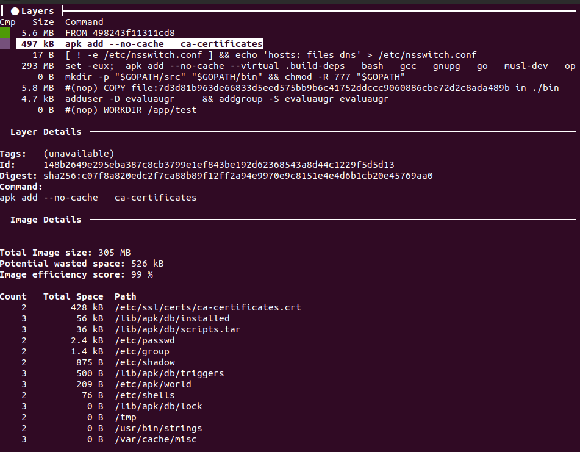

# Uso de Docker

Tenemos que construir una imagen para poder ejecutar en ella los tests. En nuestro caso, necesitamos tanto que el lenguaje `Go` esté instalado en el mismo como el gestor de tareas `Task`. Queremos que la imagen sea lo más pequeña por posible. Por eso, vamos a hacer una serie de pruebas con tres imágenes base diferentes:

* Oficial del lenguaje para `Alpine`: 299 MB. 
* `Alpine`: 5.57 MB. 
* webhippie/golang. Una imagen no oficial con el lenguaje de `Go`: 682MB. 

Se ha intentado buscar otra imagen no oficial del lenguaje que fuese más pequeña pero las existentes o no nos servían para nuestro propósito o eran incluso más pesadas. 

Primero, vamos a ver cómo resultan estas imágenes después de añadir lo necesario para ejecutar los tests. Los resultados obtenidos según el tamaño son:

* Oficial del lenguaje para `Alpine`: 314 MB https://github.com/PedroMFC/EvaluaUGR/commit/df392ccf644f3575883bbe491ad2c1bae28fcd49
* `Alpine`: 463 MB. https://github.com/PedroMFC/EvaluaUGR/commit/92772fe0f9852ad8b967d22f455154019b4175a7
* webhippie/golang. Una imagen no oficial con el lenguaje de `Go`: 696 MB. https://github.com/PedroMFC/EvaluaUGR/commit/50e1430660d5eaaf7358ffd14158bc58510f8593

Vemos que en principio las más adecuadas serían usar la oficial del lenguaje o la de `Alpine`. Destaca que en este último caso la imagen aumenta demasiado su tamaño. Veamos qué está pasando e intentemos disminuir el tamaño de ambas imágenes al máxima y ver cuál es más conveniente.

Primero en la del lenguaje oficial hemos tenido que instalar `curl` para poder descargar el gestor de tareas. Si una vez descargado el gestor lo eliminamos conseguimos reducir su tamaño un poco a 313 MB (https://github.com/PedroMFC/EvaluaUGR/commit/6dbff1c95bf5b2bf7d96e45e23c10df5be9b7f87). Vemos que en este caso solo hemos aumentado la imagen base en 14 MB. Sin embargo, vemos que no hemos uso de una herramienta que ayuda a reducir el tamaño: builds en múltiples etapas. En este caso de la imagen oficial, lo que vamos a hacer es usar una etapa para descargar el gestor de tareas y finalmente solo tendremos que copiar la carpeta en la que se ha instalado para usarla. Haciendo uso de este mecanismo obtenemos una imagen de 305 MB (https://github.com/PedroMFC/EvaluaUGR/commit/31c6bf80a042eac5f5a44cca2746e0e571e243d7). No está nada mal. Veamos un poco más qué hay dentro de la misma haciendo uso de la herramienta [dive](https://github.com/wagoodman/dive).

Vemos que tenemos una eficiencia del 99% y un espacio desperdiciado de 526 kB. Como vemos en la imagen anterior vemos que ese espacio está ocupado por los certificados en su mayor parte. Esto también podemos verlo en otra ventana que tiene la herramienta `dive` para examinar el contenido de cada capa. Como no queremos tocar nada de los certificados ya que es un tema más delicado no vamos a optimizar más este contenedor.

Pasamos ahora a ver qué ocurre cuando construimos a partir de la imagen de `Alpine` sin el lenguaje instalado. Si partimos de la imagen anterior sobre el análisis de la imagen oficial, vemos que parte de una imagen bastante pequeña (5.6 MB) y que la capa de instalación del lenguaje ocupa solamente 293 MB. ¿Cómo es posible que en nuestro caso aumente casi 460 MB? Bien, en vez de optimizar nuestra imagen partiendo de la que hemos construido nosotros mismos, viendo qué podemos eliminar, vamos a usar la oficial. Como hemos dicho, vemos que en el caso oficial la parte de instalación del lenguaje está bastante optimizado. Por eso, lo que haremos será utilizar la imagen oficial para instalar el gestor de tareas y luego copiaremos el mismo y los archivos del lenguaje a la definitiva. De este modo, obtenemos lo siguiente: 

Vemos que hemos conseguido reducir el tamaño a 303 MB (https://github.com/PedroMFC/EvaluaUGR/commit/2e5a8a6ed3b511cc20134c0211e4f6232adafcb0). También hay espacio desperdiciado, pero solamente 4.7 kB y vemos que se trata de la creación del usuario para ejecutar los tests sin privilegios. 

Por lo tanto vamos a tomar como base la imagen de `Alpine` ya que tras la optimización es la que menos espacio ocupa.

