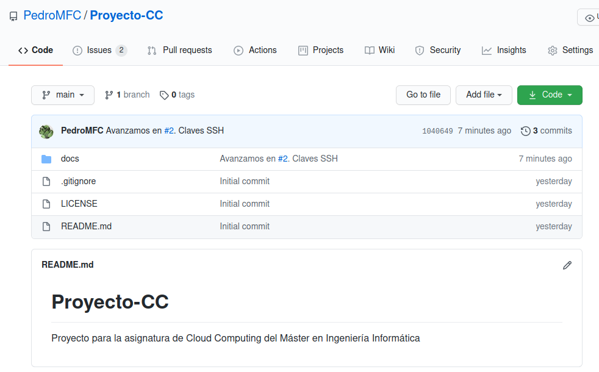
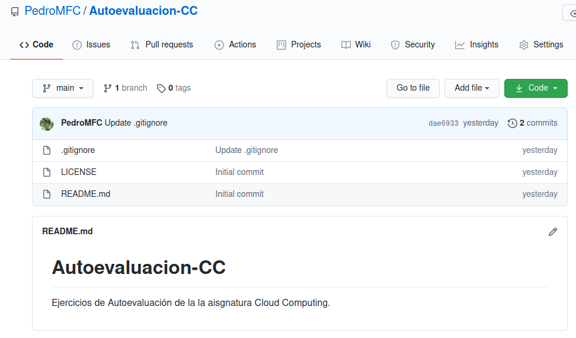
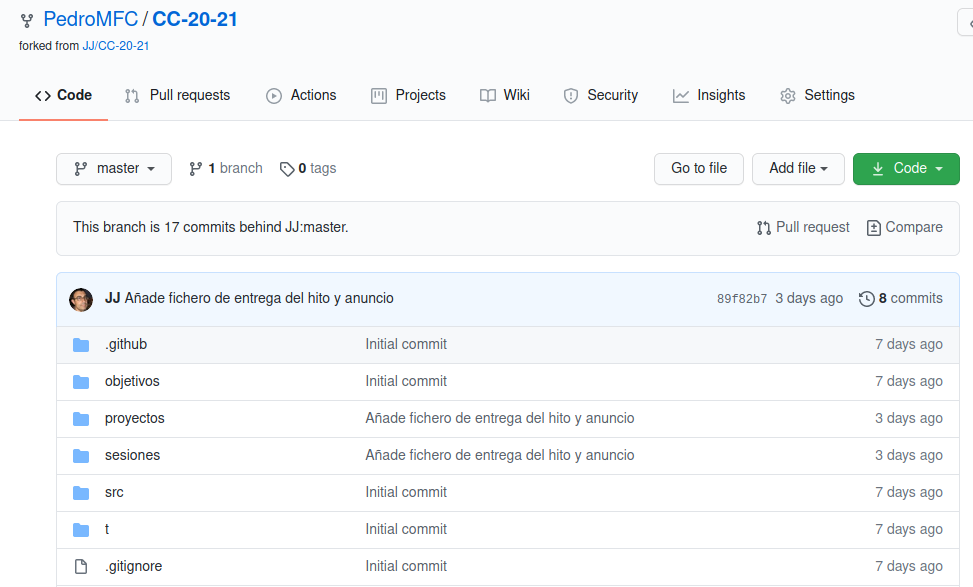
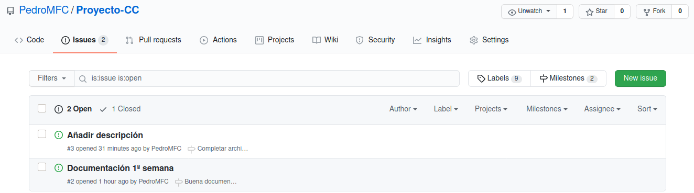
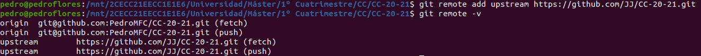
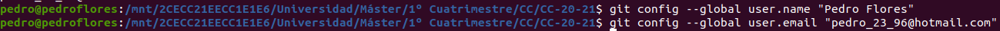
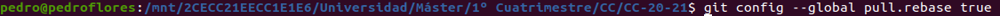
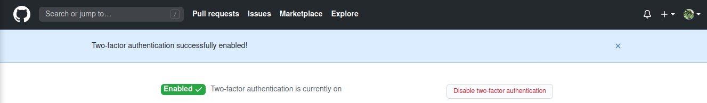

# Trabajo realizado en la primera semana de la asignatura de CC

Explicaremos en conjunto tanto el trabajo realizado en la sesión de laboratorio como el trabajo para el hito 0. 

En primer lugar, tenemos ya realizada la instalación de git. 

### Creación de par de claves y subida a GitHub

Par este proceso se ha seguido [esta guía](https://docs.github.com/es/free-pro-team@latest/github/authenticating-to-github/generating-a-new-ssh-key-and-adding-it-to-the-ssh-agent). También se incluyen las imágenes con el proceso seguido.

1. Generar la clave

2. Agregar clave al agente

3. Agregarla a la cuenta de GitHub: ya tenemos instalada la herramienta *xclip* y la usamos para copiar la clave pública

4. Accedemos a nuestra cuenta de GitHub y la añadimos dentro del apartado *Settings*

### Creación de los repositorios de la asignatura

Se han creado los tres repositorios necesarios tal y como se indica. No se cree necesario explicar su procedimiento de creación. A continuación se muestran imágenes de la pantalla principal de los mismos. Tener en cuenta que sobre todo para la creación del repositorio del proyecto de la asignatura se han incluido los tres archivos indicados y que GitHub permite crear automáticamente: `README.md`, archivo de licencia y `.gitignore`.

En el repositorio del proyecto se han comenzado a utilizar *issues* y *milestones* para incluir la documentación inicial y seguir con esta buena práctica

### Configuración de los remotos

Para añadir el remoto en la copia local del repositorio de la asignatura se ha usado la orden especificada en la [carpeta de objetivos](https://github.com/JJ/CC-20-21/tree/master/objetivos)

### Configuración de git correcta

Para establecer el correo y nombre en git usamos [esta guía](https://git-scm.com/book/es/v2/Inicio---Sobre-el-Control-de-Versiones-Configurando-Git-por-primera-vez)

Por su parte, para la configuración de la opción de *rebase* automática se ha consultado [esta página](https://coderwall.com/p/tnoiug/rebase-by-default-when-doing-git-pull)

### Edición del perfil de GitHub

Se ha modificado el perfil de GitHub para que aparezca una imagen en vez del avatar por omisión, nombre completo, ciudad y universidad.

### Activar la doble autenticación

Se muestran los pasos para activar la doble autenticación y que se muestra en [este enlace](https://docs.github.com/es/free-pro-team@latest/github/authenticating-to-github/configuring-two-factor-authentication)

Al finalizar el proceso se observa que se ha configurado correctamente

Después de la activación de la doble autenticación fue necesario seguir [este tutorial](https://medium.com/@ginnyfahs/github-error-authentication-failed-from-command-line-3a545bfd0ca8) para poder hacer *pull*.
