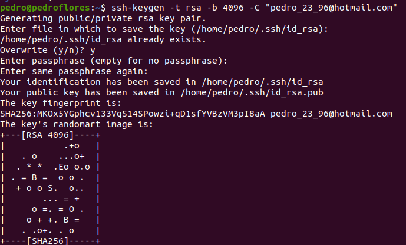
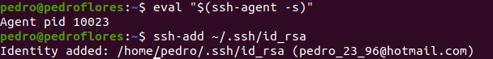
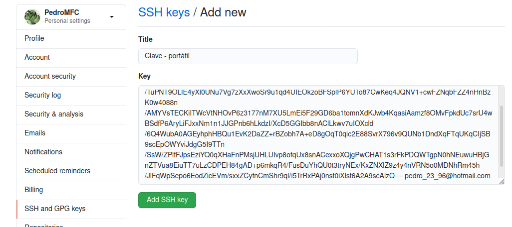

# Trabajo realizado en la primera semana de la asignatura de CC

Explicaremos en conjunto tanto el trabajo realizado en la sesión de laboratorio como el trabajo para el hito 0. 

En primer lugar, tenemos ya realizada la instalación de git. 

### Creación de par de claves y subida a GitHub

Par este proceso se ha seguido [esta guía](https://docs.github.com/es/free-pro-team@latest/github/authenticating-to-github/generating-a-new-ssh-key-and-adding-it-to-the-ssh-agent). También se incluyen las imágenes con el proceso seguido.

1. Generar la clave

2. Agregar clave al agente

3. Agregarla a la cuenta de GitHub: ya tenemos instalada la herramienta *xclip* y la usamos para copiar la clave pública

4. Accedemos a nuestra cuenta de GitHub y la añadimos dentro del apartado *Settings*

